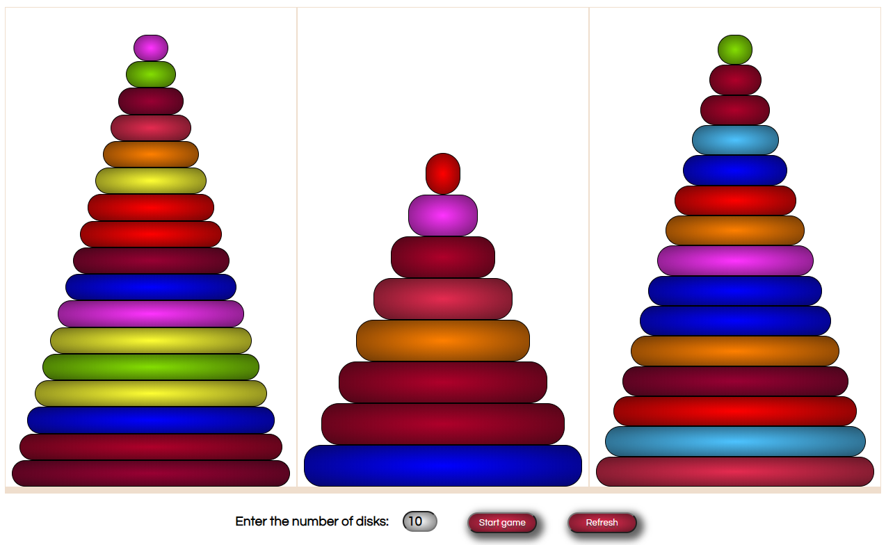

  
game  published at:    https://ev-ran.github.io/Tower-of-Hanoi.-Game/.

## Tower of Hanoi

The Tower of Hanoi is a puzzle. It consists of three rods and a number of disks of different sizes, which can slide onto any rod. The puzzle starts with all the disks stacked on one rod, largest at the bottom, smallest at the top.

Tower of Hanoi game implemented with HTML, CSS, and JavaScript. In each game, the players will be sitting at the same mouse & keyboard, alternating turns.

#### in game:
* arbitrary number of disks can be set by user
* build the Tower with user-defined number of disks and random set of disk colors
* reset / refresh game: build towers with random combitations of disks and disk colors - just for fun

